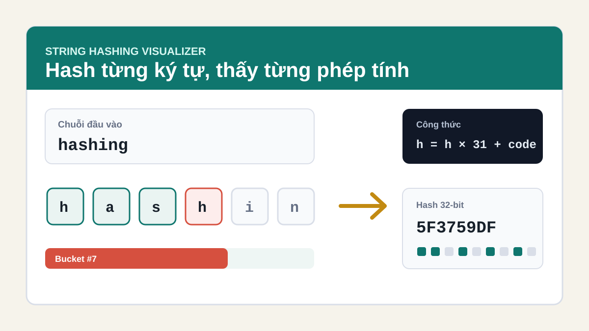

# Hashing Visualizer



**Hashing Visualizer** là một trang web minh hoạ trực quan cách các thuật toán hashing xử lý chuỗi theo từng ký tự. Dự án phù hợp để học hoặc giải thích khái niệm string hashing, hash table, bucket và hiệu ứng avalanche.

## Tính năng

- Nhập chuỗi bất kỳ và quan sát hash thay đổi sau mỗi ký tự.
- Điều khiển mô phỏng từng bước bằng slider, nút lùi, nút tiến, chạy tự động và reset.
- Hỗ trợ 3 thuật toán:
  - Polynomial rolling hash
  - DJB2
  - FNV-1a 32-bit
- Hiển thị công thức tính hash ở từng bước.
- Hiển thị giá trị hash dạng hex và dấu vân tay nhị phân 32-bit.
- Minh hoạ cách key được phân bố vào 12 bucket trong bảng hash.
- So sánh hiệu ứng avalanche khi thay đổi chuỗi đầu vào.

## Chạy local

Bạn có thể mở trực tiếp file `index.html` bằng trình duyệt.

Hoặc chạy local server:

```bash
python3 -m http.server 8000
```

Sau đó mở trình duyệt tại:

```text
http://localhost:8000
```

## Cấu trúc thư mục

```text
.
├── assets/
│   └── hashing-preview.svg
├── index.html
├── styles.css
├── app.js
└── README.md
```

## Công nghệ sử dụng

- HTML
- CSS
- JavaScript thuần

Dự án không cần cài đặt dependency.
